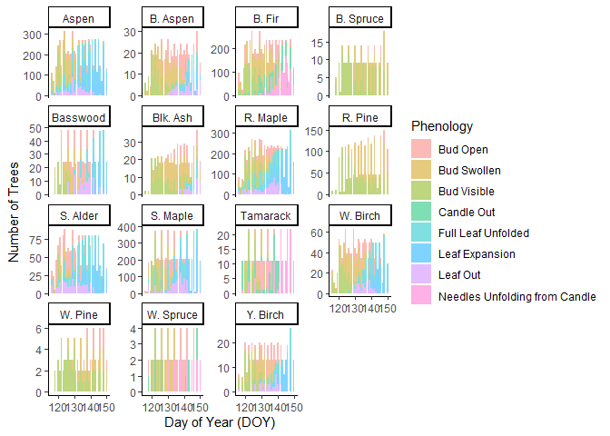

Final Project
================
Caleb Miller
2025-04-29

### Getting Started

First things first, I will have to load in tidyverse, download my data,
and also get a look at my working directory

``` r
#Load tidyverse

library(tidyverse)
```

    ## ── Attaching core tidyverse packages ──────────────────────── tidyverse 2.0.0 ──
    ## ✔ dplyr     1.1.4     ✔ readr     2.1.5
    ## ✔ forcats   1.0.0     ✔ stringr   1.5.1
    ## ✔ ggplot2   3.5.1     ✔ tibble    3.2.1
    ## ✔ lubridate 1.9.4     ✔ tidyr     1.3.1
    ## ✔ purrr     1.0.4     
    ## ── Conflicts ────────────────────────────────────────── tidyverse_conflicts() ──
    ## ✖ dplyr::filter() masks stats::filter()
    ## ✖ dplyr::lag()    masks stats::lag()
    ## ℹ Use the conflicted package (<http://conflicted.r-lib.org/>) to force all conflicts to become errors

``` r
#Getting my working directory

getwd()
```

    ## [1] "C:/Users/caleb/Documents/School/WFSC596DataWrangling/R Coding/MillerFinalProject/Scripts"

``` r
#Reading in my data, it should already be placed in DataRaw, under XLSX

unzip(zipfile = "Data/DataRaw/XLSX/WI_Tree_Phenology.zip", exdir = "Data/DataRaw/XLSX/")
```

    ## Warning in unzip(zipfile = "Data/DataRaw/XLSX/WI_Tree_Phenology.zip", exdir =
    ## "Data/DataRaw/XLSX/"): error 1 in extracting from zip file

These are xlsx files, not csv files. Now, I could just open each file
and save them as csv’s, but I figured this is a good opportunity
early-on to introduce a loop where I can take in the files individually
and convert them to csv.

REVIEW: I’m not sure if this explanation is necessary; instead, you
could just start with the readxl. According to Ellen, you could mention
that this method won’t work, so you have to do it the following way, but
including all the code that didn’t work isn’t necessary.

``` r
# install.packages("readxl") # This is the package needed to read the excel documents

#If you don't have the readxl package, you can download it by deleting the # in front of the install.packages("readxl") and running the code
```

### Starting the For Loop

``` r
#Now we can get started with creating the for loop

library(readxl)

#I found a trick where I can assign directories names instead of typing every time

XLFolder <- "Data/DataRaw/XLSX/WI_Tree_Phenology/"
CSVFolder <- "Data/DataRaw/CSV/"

#Here you make the vector of the names of the files

XLFiles <- list.files(XLFolder, pattern = ".xlsx")
XLFiles
```

    ## character(0)

``` r
#Finally, the loop that creates the CSVs from XLSXs

for(i in XLFiles) {
  readxl::read_excel(paste0(XLFolder, i)) %>% #allows it to read in the XLSX doc
  write.csv(., paste0(CSVFolder, gsub(".xlsx", ".csv", i))) #tells it to take the XLSX doc, change it to a CSV by changing .xlsx to .csv, then put it in the CSV folder
}
```

Was that possibly more difficult than need be? Probably but I did it and
I feel awesome.

Now, the next thing I like to do is get a good look at the docs. To do
that, I’m going to read them in, but only get the heads of each one

``` r
#Reading in the files themselves

SpringCoords <- read_csv("../Data/DataRaw/CSV/spring_coordinate_data.csv")
```

    ## New names:
    ## Rows: 888 Columns: 8
    ## ── Column specification
    ## ──────────────────────────────────────────────────────── Delimiter: "," chr
    ## (3): TreeID, Species, Coordinate System/Datum dbl (5): ...1, Site_X, Site_Y,
    ## Tree_x, Tree_y
    ## ℹ Use `spec()` to retrieve the full column specification for this data. ℹ
    ## Specify the column types or set `show_col_types = FALSE` to quiet this message.
    ## • `` -> `...1`

``` r
head(SpringCoords)
```

    ## # A tibble: 6 × 8
    ##    ...1 TreeID Species   Site_X   Site_Y  Tree_x   Tree_y Coordinate System/Da…¹
    ##   <dbl> <chr>  <chr>      <dbl>    <dbl>   <dbl>    <dbl> <chr>                 
    ## 1     1 A1#1   R. Maple 712371. 5090896. 712370. 5090891. UTM Zone 15N/WGS 1984 
    ## 2     2 A1#2   S. Alder 712371. 5090896. 712372. 5090895. <NA>                  
    ## 3     3 A1#3   B. Fir   712371. 5090896. 712371. 5090898. <NA>                  
    ## 4     4 A2#1   R. Maple 712346. 5090895. 712343. 5090898. <NA>                  
    ## 5     5 A2#2   S. Alder 712346. 5090895. 712346. 5090895. <NA>                  
    ## 6     6 A2#3   W. Cedar 712346. 5090895. 712352. 5090897. <NA>                  
    ## # ℹ abbreviated name: ¹​`Coordinate System/Datum`

``` r
PhenoCodes <- read_csv("../Data/DataRaw/CSV/WI_Spring_Phenophase_Data_Codes.csv")
```

    ## New names:
    ## Rows: 24 Columns: 4
    ## ── Column specification
    ## ──────────────────────────────────────────────────────── Delimiter: "," chr
    ## (2): Deciduous Species, non-Deciduous Species dbl (2): ...1, Code
    ## ℹ Use `spec()` to retrieve the full column specification for this data. ℹ
    ## Specify the column types or set `show_col_types = FALSE` to quiet this message.
    ## • `` -> `...1`

``` r
head(PhenoCodes)
```

    ## # A tibble: 6 × 4
    ##    ...1  Code `Deciduous Species`  `non-Deciduous Species`
    ##   <dbl> <dbl> <chr>                <chr>                  
    ## 1     1   100 Bud Visible (<10%)   Bud Visible (<10%)     
    ## 2     2   110 Bud Visible (10-50%) Bud Visible (10-50%)   
    ## 3     3   150 Bud Visible (50-90%) Bud Visible (50-90%)   
    ## 4     4   190 Bud Visible (>90%)   Bud Visible (>90%)     
    ## 5     5   200 Bud Swollen (<10%)   Bud Swollen (<10%)     
    ## 6     6   210 Bud Swollen (10-50%) Bud Swollen (10-50%)

``` r
TreeCoords <- read_csv("../Data/DataRaw/CSV/WI_Spring_Tree_Coordinates.csv")
```

    ## New names:
    ## Rows: 888 Columns: 8
    ## ── Column specification
    ## ──────────────────────────────────────────────────────── Delimiter: "," chr
    ## (3): TreeID, Species, Coordinate System/Datum dbl (5): ...1, Site_X, Site_Y,
    ## Tree_x, Tree_y
    ## ℹ Use `spec()` to retrieve the full column specification for this data. ℹ
    ## Specify the column types or set `show_col_types = FALSE` to quiet this message.
    ## • `` -> `...1`

``` r
head(TreeCoords)
```

    ## # A tibble: 6 × 8
    ##    ...1 TreeID Species   Site_X   Site_Y  Tree_x   Tree_y Coordinate System/Da…¹
    ##   <dbl> <chr>  <chr>      <dbl>    <dbl>   <dbl>    <dbl> <chr>                 
    ## 1     1 A1#1   R. Maple 712371. 5090896. 712370. 5090891. UTM Zone 15N/WGS 1984 
    ## 2     2 A1#2   S. Alder 712371. 5090896. 712372. 5090895. <NA>                  
    ## 3     3 A1#3   B. Fir   712371. 5090896. 712371. 5090898. <NA>                  
    ## 4     4 A2#1   R. Maple 712346. 5090895. 712343. 5090898. <NA>                  
    ## 5     5 A2#2   S. Alder 712346. 5090895. 712346. 5090895. <NA>                  
    ## 6     6 A2#3   W. Cedar 712346. 5090895. 712352. 5090897. <NA>                  
    ## # ℹ abbreviated name: ¹​`Coordinate System/Datum`

``` r
PhenoAF <- read_csv("../Data/DataRaw/CSV/WI_Tree_Phenology_A_F.csv")
```

    ## New names:
    ## Rows: 68 Columns: 221
    ## ── Column specification
    ## ──────────────────────────────────────────────────────── Delimiter: "," chr
    ## (220): ...2, ...3, ...4, Tree ID, A1#1, A1#2, A1#3, A2#1, A2#2, A2#3, A3... dbl
    ## (1): ...1
    ## ℹ Use `spec()` to retrieve the full column specification for this data. ℹ
    ## Specify the column types or set `show_col_types = FALSE` to quiet this message.
    ## • `` -> `...1`
    ## • `...1` -> `...2`
    ## • `...2` -> `...3`
    ## • `...3` -> `...4`

``` r
head(PhenoAF)
```

    ## # A tibble: 6 × 221
    ##    ...1 ...2  ...3  ...4  `Tree ID` `A1#1`   `A1#2`  `A1#3` `A2#1` `A2#2` `A2#3`
    ##   <dbl> <chr> <chr> <chr> <chr>     <chr>    <chr>   <chr>  <chr>  <chr>  <chr> 
    ## 1     1 Year  Date  DOY   Species   R. Maple S. Ald… B. Fir R. Ma… S. Al… W. Ce…
    ## 2     2 2006  38836 119   <NA>      290      310     190    290    350    -99   
    ## 3     3 2006  38838 121   <NA>      390      310     190    290    350    -99   
    ## 4     4 2006  38840 123   <NA>      400      310     290    290    400    -99   
    ## 5     5 2006  38841 124   <NA>      450      310     290    410    410    -99   
    ## 6     6 2006  38843 126   <NA>      450      310     290    410    500    -99   
    ## # ℹ 210 more variables: `A3#1` <chr>, `A3#2` <chr>, `A3#3` <chr>, `A4#1` <chr>,
    ## #   `A4#2` <chr>, `A4#3` <chr>, `A5#1` <chr>, `A5#2` <chr>, `A5#3` <chr>,
    ## #   `A6#1` <chr>, `A6#2` <chr>, `A6#3` <chr>, `A7#1` <chr>, `A7#2` <chr>,
    ## #   `A7#3` <chr>, `A8#1` <chr>, `A8#2` <chr>, `A8#3` <chr>, `A9#1` <chr>,
    ## #   `A9#2` <chr>, `A9#3` <chr>, `A10#1` <chr>, `A10#2` <chr>, `A10#3` <chr>,
    ## #   `A11#1` <chr>, `A11#2` <chr>, `A11#3` <chr>, `A12#1` <chr>, `A12#2` <chr>,
    ## #   `A12#3` <chr>, `B1#1` <chr>, `B1#2` <chr>, `B1#3` <chr>, `B2#1` <chr>, …

``` r
PhenoGL <- read_csv("../Data/DataRaw/CSV/WI_Tree_Phenology_G_L.csv")
```

    ## New names:
    ## Rows: 38 Columns: 221
    ## ── Column specification
    ## ──────────────────────────────────────────────────────── Delimiter: "," chr
    ## (220): ...2, ...3, ...4, Tree ID, G1#1, G1#2, G1#3, G2#1, G2#2, G2#3, G3... dbl
    ## (1): ...1
    ## ℹ Use `spec()` to retrieve the full column specification for this data. ℹ
    ## Specify the column types or set `show_col_types = FALSE` to quiet this message.
    ## • `` -> `...1`
    ## • `...1` -> `...2`
    ## • `...2` -> `...3`
    ## • `...3` -> `...4`

``` r
head(PhenoGL)
```

    ## # A tibble: 6 × 221
    ##    ...1 ...2  ...3  ...4  `Tree ID` `G1#1` `G1#2` `G1#3` `G2#1`  `G2#2`   `G2#3`
    ##   <dbl> <chr> <chr> <chr> <chr>     <chr>  <chr>  <chr>  <chr>   <chr>    <chr> 
    ## 1     1 Year  Date  DOY   Species   Aspen  Aspen  B. Fir R. Pine R. Maple R. Pi…
    ## 2     2 2008  38836 120   <NA>      -99    100    110    -99     100      -99   
    ## 3     3 2008  38838 122   <NA>      110    100    110    -99     110      -99   
    ## 4     4 2008  38840 124   <NA>      150    150    150    -99     110      -99   
    ## 5     5 2008  39573 126   <NA>      190    200    150    100     110      100   
    ## 6     6 2008  39575 128   <NA>      300    300    150    100     200      110   
    ## # ℹ 210 more variables: `G3#1` <chr>, `G3#2` <chr>, `G3#3` <chr>, `G4#1` <chr>,
    ## #   `G4#2` <chr>, `G4#3` <chr>, `G5#1` <chr>, `G5#2` <chr>, `G5#3` <chr>,
    ## #   `G6#1` <chr>, `G6#2` <chr>, `G6#3` <chr>, `G7#1` <chr>, `G7#2` <chr>,
    ## #   `G7#3` <chr>, `G8#1` <chr>, `G8#2` <chr>, `G8#3` <chr>, `G9#1` <chr>,
    ## #   `G9#2` <chr>, `G9#3` <chr>, `G10#1` <chr>, `G10#2` <chr>, `G10#3` <chr>,
    ## #   `G11#1` <chr>, `G11#2` <chr>, `G11#3` <chr>, `G12#1` <chr>, `G12#2` <chr>,
    ## #   `G12#3` <chr>, `H1#1` <chr>, `H1#2` <chr>, `H1#3` <chr>, `H2#1` <chr>, …

``` r
PhenoMR <- read_csv("../Data/DataRaw/CSV/WI_Tree_Phenology_M_R.csv")
```

    ## New names:
    ## Rows: 38 Columns: 228
    ## ── Column specification
    ## ──────────────────────────────────────────────────────── Delimiter: "," chr
    ## (227): ...2, ...3, ...4, Tree ID, M1#1, M1#2, M1#3, M2#1, M2#2, M2#3, M3... dbl
    ## (1): ...1
    ## ℹ Use `spec()` to retrieve the full column specification for this data. ℹ
    ## Specify the column types or set `show_col_types = FALSE` to quiet this message.
    ## • `` -> `...1`
    ## • `...1` -> `...2`
    ## • `...2` -> `...3`
    ## • `...3` -> `...4`

``` r
head(PhenoMR)
```

    ## # A tibble: 6 × 228
    ##    ...1 ...2  ...3  ...4  `Tree ID` `M1#1`   `M1#2`  `M1#3` `M2#1` `M2#2` `M2#3`
    ##   <dbl> <chr> <chr> <chr> <chr>     <chr>    <chr>   <chr>  <chr>  <chr>  <chr> 
    ## 1     1 Year  Date  DOY   Species   S. Maple S. Map… S. Ma… S. Ma… R. Pi… R. Pi…
    ## 2     2 2008  38836 120   <NA>      190      150     150    150    100    150   
    ## 3     3 2008  38838 122   <NA>      190      190     190    200    100    150   
    ## 4     4 2008  38840 124   <NA>      190      190     190    210    100    150   
    ## 5     5 2008  39573 126   <NA>      190      190     200    210    100    150   
    ## 6     6 2008  39575 128   <NA>      200      250     200    300    100    150   
    ## # ℹ 217 more variables: `M3#1` <chr>, `M3#2` <chr>, `M3#3` <chr>, `M4#1` <chr>,
    ## #   `M4#2` <chr>, `M4#3` <chr>, `M5#1` <chr>, `M5#2` <chr>, `M5#3` <chr>,
    ## #   `M6#1` <chr>, `M6#2` <chr>, `M6#3` <chr>, `M7#1` <chr>, `M7#2` <chr>,
    ## #   `M7#3` <chr>, `M8#1` <chr>, `M8#2` <chr>, `M8#3` <chr>, `M9#1` <chr>,
    ## #   `M9#2` <chr>, `M9#3` <chr>, `M10#1` <chr>, `M10#2` <chr>, `M10#3` <chr>,
    ## #   `M11#1` <chr>, `M11#2` <chr>, `M11#3` <chr>, `M12#1` <chr>, `M12#2` <chr>,
    ## #   `M12#3` <chr>, `N1#1` <chr>, `N1#2` <chr>, `N1#3` <chr>, `N2#1` <chr>, …

``` r
PhenoSX <- read_csv("../Data/DataRaw/CSV/WI_Tree_Phenology_S_X.csv")
```

    ## New names:
    ## Rows: 38 Columns: 238
    ## ── Column specification
    ## ──────────────────────────────────────────────────────── Delimiter: "," chr
    ## (237): ...2, ...3, ...4, Tree ID, S1#1, S1#2, S1#3, S2#1, S2#2, S2#3, S3... dbl
    ## (1): ...1
    ## ℹ Use `spec()` to retrieve the full column specification for this data. ℹ
    ## Specify the column types or set `show_col_types = FALSE` to quiet this message.
    ## • `` -> `...1`
    ## • `...1` -> `...2`
    ## • `...2` -> `...3`
    ## • `...3` -> `...4`

``` r
head(PhenoSX)
```

    ## # A tibble: 6 × 238
    ##    ...1 ...2  ...3  ...4  `Tree ID` `S1#1`   `S1#2`  `S1#3` `S2#1` `S2#2` `S2#3`
    ##   <dbl> <chr> <chr> <chr> <chr>     <chr>    <chr>   <chr>  <chr>  <chr>  <chr> 
    ## 1     1 Year  Date  DOY   Species   B. Aspen S. Map… R. Ma… S. Ma… S. Ma… R. Ma…
    ## 2     2 2008  38836 120   <NA>      150      150     -99    150    150    -99   
    ## 3     3 2008  38838 122   <NA>      190      150     -99    150    150    150   
    ## 4     4 2008  38840 124   <NA>      300      150     -99    210    300    210   
    ## 5     5 2008  39573 126   <NA>      300      150     -99    210    300    210   
    ## 6     6 2008  39575 128   <NA>      310      300     -99    300    300    210   
    ## # ℹ 227 more variables: `S3#1` <chr>, `S3#2` <chr>, `S3#3` <chr>, `S4#1` <chr>,
    ## #   `S4#2` <chr>, `S4#3` <chr>, `S5#1` <chr>, `S5#2` <chr>, `S5#3` <chr>,
    ## #   `S6#1` <chr>, `S6#2` <chr>, `S6#3` <chr>, `S7#1` <chr>, `S7#2` <chr>,
    ## #   `S7#3` <chr>, `S7#4` <chr>, `S8#1` <chr>, `S8#2` <chr>, `S8#3` <chr>,
    ## #   `S8#4` <chr>, `S8#5` <chr>, `S8#6` <chr>, `S9#1` <chr>, `S9#2` <chr>,
    ## #   `S9#3` <chr>, `S9#4` <chr>, `S9#5` <chr>, `S10#1` <chr>, `S10#2` <chr>,
    ## #   `S10#3` <chr>, `S11#1` <chr>, `S11#2` <chr>, `S11#3` <chr>, …

``` r
PhenoSX
```

    ## # A tibble: 38 × 238
    ##     ...1 ...2  ...3  ...4  `Tree ID` `S1#1`   `S1#2` `S1#3` `S2#1` `S2#2` `S2#3`
    ##    <dbl> <chr> <chr> <chr> <chr>     <chr>    <chr>  <chr>  <chr>  <chr>  <chr> 
    ##  1     1 Year  Date  DOY   Species   B. Aspen S. Ma… R. Ma… S. Ma… S. Ma… R. Ma…
    ##  2     2 2008  38836 120   <NA>      150      150    -99    150    150    -99   
    ##  3     3 2008  38838 122   <NA>      190      150    -99    150    150    150   
    ##  4     4 2008  38840 124   <NA>      300      150    -99    210    300    210   
    ##  5     5 2008  39573 126   <NA>      300      150    -99    210    300    210   
    ##  6     6 2008  39575 128   <NA>      310      300    -99    300    300    210   
    ##  7     7 2008  39577 130   <NA>      310      300    -99    300    300    210   
    ##  8     8 2008  39579 132   <NA>      310      300    -99    300    310    250   
    ##  9     9 2008  39581 134   <NA>      310      300    -99    300    310    250   
    ## 10    10 2008  38852 136   <NA>      310      300    -99    300    310    250   
    ## # ℹ 28 more rows
    ## # ℹ 227 more variables: `S3#1` <chr>, `S3#2` <chr>, `S3#3` <chr>, `S4#1` <chr>,
    ## #   `S4#2` <chr>, `S4#3` <chr>, `S5#1` <chr>, `S5#2` <chr>, `S5#3` <chr>,
    ## #   `S6#1` <chr>, `S6#2` <chr>, `S6#3` <chr>, `S7#1` <chr>, `S7#2` <chr>,
    ## #   `S7#3` <chr>, `S7#4` <chr>, `S8#1` <chr>, `S8#2` <chr>, `S8#3` <chr>,
    ## #   `S8#4` <chr>, `S8#5` <chr>, `S8#6` <chr>, `S9#1` <chr>, `S9#2` <chr>,
    ## #   `S9#3` <chr>, `S9#4` <chr>, `S9#5` <chr>, `S10#1` <chr>, `S10#2` <chr>, …

Great! Now we can look at all the data and come to some conculsions!
Chiefly, there were certainly some decisions that were made with this
data set. First and foremost, SpringCoords and TreeCoords are the same!
Don’t need two identical data tables in any situation. Further, all the
Pheno data is broken up into 4 different tables sorted by A-F, G-L, M-R,
and S-X. And on top of that, we do not need the 5th column at all and
the data is all funky, specifically the way its writen includes the
species of the tree, which is recorded in the TreeCoords (redundant
data).

Other than that, there’s other clean up (-99 instead of NA, excel messed
up the date data) but first we need to format the data in a way that
doesn’t make my head hurt.

I believe the most important place to start would be merging all the
Phenos into one table, that way whatever I do to it, I do to all of
them.

Which is easier said than done, because these tables are Messed Up.

### Cleaning the Pheno Tables

``` r
#First things first, I'm going to play around with PhenoAF a bit to see if i can format it the way I want

#I want to fix one thing right away: the really weird date columns and weird first column. But how do I do that?
#I don't need that first row, its just column names or data I have in other sheets
#Same with the Tree ID Column

CleanMyTables <- function(Table) { 
  RenameTable <- Table[-1, -5] %>% #Gets rid of unnecessary columns
    rename(Year = `...2`, #renames columns
         Date = `...3`,
         DOY = `...4`)
  RenameTable$DOY <- as.numeric(RenameTable$DOY) #changes DOY to numbers instead of characters
  CleanTable <- RenameTable %>%
    mutate(Date = as.Date(DOY-1, origin = paste0(Year, "-01-01"))) %>% #gets actual date using the DOY, replacing the messed-up Excel dates
    select(!`...1`) #Gets rid of weird first column
  return(CleanTable)
}

PhenoAF <- CleanMyTables(PhenoAF)
PhenoGL <- CleanMyTables(PhenoGL) #Using my function to just clean the tables
PhenoMR <- CleanMyTables(PhenoMR)
PhenoSX <- CleanMyTables(PhenoSX)

PhenoSX # To check that the function worked
```

    ## # A tibble: 37 × 236
    ##    Year  Date         DOY `S1#1` `S1#2` `S1#3` `S2#1` `S2#2` `S2#3` `S3#1`
    ##    <chr> <date>     <dbl> <chr>  <chr>  <chr>  <chr>  <chr>  <chr>  <chr> 
    ##  1 2008  2008-04-29   120 150    150    -99    150    150    -99    150   
    ##  2 2008  2008-05-01   122 190    150    -99    150    150    150    150   
    ##  3 2008  2008-05-03   124 300    150    -99    210    300    210    200   
    ##  4 2008  2008-05-05   126 300    150    -99    210    300    210    210   
    ##  5 2008  2008-05-07   128 310    300    -99    300    300    210    210   
    ##  6 2008  2008-05-09   130 310    300    -99    300    300    210    210   
    ##  7 2008  2008-05-11   132 310    300    -99    300    310    250    300   
    ##  8 2008  2008-05-13   134 310    300    -99    300    310    250    300   
    ##  9 2008  2008-05-15   136 310    300    -99    300    310    250    300   
    ## 10 2008  2008-05-17   138 310    300    -99    310    400    350    300   
    ## # ℹ 27 more rows
    ## # ℹ 226 more variables: `S3#2` <chr>, `S3#3` <chr>, `S4#1` <chr>, `S4#2` <chr>,
    ## #   `S4#3` <chr>, `S5#1` <chr>, `S5#2` <chr>, `S5#3` <chr>, `S6#1` <chr>,
    ## #   `S6#2` <chr>, `S6#3` <chr>, `S7#1` <chr>, `S7#2` <chr>, `S7#3` <chr>,
    ## #   `S7#4` <chr>, `S8#1` <chr>, `S8#2` <chr>, `S8#3` <chr>, `S8#4` <chr>,
    ## #   `S8#5` <chr>, `S8#6` <chr>, `S9#1` <chr>, `S9#2` <chr>, `S9#3` <chr>,
    ## #   `S9#4` <chr>, `S9#5` <chr>, `S10#1` <chr>, `S10#2` <chr>, `S10#3` <chr>, …

If you look at the data tables, each of the sites are named A1, A2, A3,
B1, B2, B3, etc, and then the individual trees are named something like
A1#1, A1#2, A1#3. Cleaning up these naming conventions will come next as
it is not the best, but we will get to that. The most important to know
right now is that PhenoAF has all the A through F sites, PhenoGL has all
the G through L sites. The next thing we will do is merge them all into
Pheno AX, which will contain all of the sites named A through X.

### Joining the Tables

Now: I still want to mix all the data together into one big table, so to
do that, I’m going to use a full_join and join_by(Date)

``` r
PhenoAX <- PhenoAF %>% 
  full_join(PhenoGL, join_by(Date, DOY, Year)) %>% #Organizes by Date, DOY, and Year. Otherwise, there will be duplicate DOY and Year columns (even though they all match by Date)
  full_join(PhenoMR, join_by(Date, DOY, Year)) %>% 
  full_join(PhenoSX, join_by(Date, DOY, Year))
PhenoAX
```

    ## # A tibble: 75 × 891
    ##    Year  Date         DOY `A1#1` `A1#2` `A1#3` `A2#1` `A2#2` `A2#3` `A3#1`
    ##    <chr> <date>     <dbl> <chr>  <chr>  <chr>  <chr>  <chr>  <chr>  <chr> 
    ##  1 2006  2006-04-29   119 290    310    190    290    350    -99    400   
    ##  2 2006  2006-05-01   121 390    310    190    290    350    -99    400   
    ##  3 2006  2006-05-03   123 400    310    290    290    400    -99    510   
    ##  4 2006  2006-05-04   124 450    310    290    410    410    -99    510   
    ##  5 2006  2006-05-06   126 450    310    290    410    500    -99    510   
    ##  6 2006  2006-05-08   128 490    350    290    410    500    -99    550   
    ##  7 2006  2006-05-10   130 550    400    350    550    510    -99    590   
    ##  8 2006  2006-05-13   133 550    410    400    550    550    -99    590   
    ##  9 2006  2006-05-15   135 590    410    410    550    550    -99    600   
    ## 10 2006  2006-05-17   137 600    490    410    550    550    -99    625   
    ## # ℹ 65 more rows
    ## # ℹ 881 more variables: `A3#2` <chr>, `A3#3` <chr>, `A4#1` <chr>, `A4#2` <chr>,
    ## #   `A4#3` <chr>, `A5#1` <chr>, `A5#2` <chr>, `A5#3` <chr>, `A6#1` <chr>,
    ## #   `A6#2` <chr>, `A6#3` <chr>, `A7#1` <chr>, `A7#2` <chr>, `A7#3` <chr>,
    ## #   `A8#1` <chr>, `A8#2` <chr>, `A8#3` <chr>, `A9#1` <chr>, `A9#2` <chr>,
    ## #   `A9#3` <chr>, `A10#1` <chr>, `A10#2` <chr>, `A10#3` <chr>, `A11#1` <chr>,
    ## #   `A11#2` <chr>, `A11#3` <chr>, `A12#1` <chr>, `A12#2` <chr>, …

### Make Data Long, Not Wide

Now! This data is way too wide, and the columns are named after data
(Tree and Site description). So now we are going to reassign them into a
single column, named TreeID, and then we are going to split that column
so that there is also a Site column (remember, A1#1 is a TreeID, with A1
denoting the site and \#1 denoting the specific tree at that site).

``` r
LongAX <- PhenoAX %>% #LongAX is the long version of PhenoAX
  pivot_longer(`A1#1`:`X12#3`,
               names_to = "TreeID",
               values_to = "Phenophase") #The Pheno data needs to be added to a Phenophase column

head(LongAX)
```

    ## # A tibble: 6 × 5
    ##   Year  Date         DOY TreeID Phenophase
    ##   <chr> <date>     <dbl> <chr>  <chr>     
    ## 1 2006  2006-04-29   119 A1#1   290       
    ## 2 2006  2006-04-29   119 A1#2   310       
    ## 3 2006  2006-04-29   119 A1#3   190       
    ## 4 2006  2006-04-29   119 A2#1   290       
    ## 5 2006  2006-04-29   119 A2#2   350       
    ## 6 2006  2006-04-29   119 A2#3   -99

``` r
tail(LongAX)
```

    ## # A tibble: 6 × 5
    ##   Year  Date         DOY TreeID Phenophase
    ##   <chr> <date>     <dbl> <chr>  <chr>     
    ## 1 2010  2010-05-26   146 X11#1  675       
    ## 2 2010  2010-05-26   146 X11#2  590       
    ## 3 2010  2010-05-26   146 X11#3  675       
    ## 4 2010  2010-05-26   146 X12#1  100       
    ## 5 2010  2010-05-26   146 X12#2  675       
    ## 6 2010  2010-05-26   146 X12#3  675

Now I am going to make a split from TreeID to add a Site column

``` r
LongAX <- LongAX %>% 
  separate(TreeID, c("Site", "TreeID"), sep = "#")

head(LongAX)
```

    ## # A tibble: 6 × 6
    ##   Year  Date         DOY Site  TreeID Phenophase
    ##   <chr> <date>     <dbl> <chr> <chr>  <chr>     
    ## 1 2006  2006-04-29   119 A1    1      290       
    ## 2 2006  2006-04-29   119 A1    2      310       
    ## 3 2006  2006-04-29   119 A1    3      190       
    ## 4 2006  2006-04-29   119 A2    1      290       
    ## 5 2006  2006-04-29   119 A2    2      350       
    ## 6 2006  2006-04-29   119 A2    3      -99

``` r
tail(LongAX)
```

    ## # A tibble: 6 × 6
    ##   Year  Date         DOY Site  TreeID Phenophase
    ##   <chr> <date>     <dbl> <chr> <chr>  <chr>     
    ## 1 2010  2010-05-26   146 X11   1      675       
    ## 2 2010  2010-05-26   146 X11   2      590       
    ## 3 2010  2010-05-26   146 X11   3      675       
    ## 4 2010  2010-05-26   146 X12   1      100       
    ## 5 2010  2010-05-26   146 X12   2      675       
    ## 6 2010  2010-05-26   146 X12   3      675

``` r
LongAX
```

    ## # A tibble: 66,600 × 6
    ##    Year  Date         DOY Site  TreeID Phenophase
    ##    <chr> <date>     <dbl> <chr> <chr>  <chr>     
    ##  1 2006  2006-04-29   119 A1    1      290       
    ##  2 2006  2006-04-29   119 A1    2      310       
    ##  3 2006  2006-04-29   119 A1    3      190       
    ##  4 2006  2006-04-29   119 A2    1      290       
    ##  5 2006  2006-04-29   119 A2    2      350       
    ##  6 2006  2006-04-29   119 A2    3      -99       
    ##  7 2006  2006-04-29   119 A3    1      400       
    ##  8 2006  2006-04-29   119 A3    2      290       
    ##  9 2006  2006-04-29   119 A3    3      190       
    ## 10 2006  2006-04-29   119 A4    1      290       
    ## # ℹ 66,590 more rows

### Correct NAs

Now that I have my one massive data sheet, I’m going to remove false
NAs, recorded here as -99, and then I am going to drop any rows with NA
in the Phenophase column. I am doing this because it is likely that
certain sites were not monitored during a certain year, or maybe their
leaves started opening later in the year, but this data is for observing
the Phenophase, so if there is no data, I do not need that row.

``` r
LongAX <- LongAX %>% 
  mutate(Phenophase = na_if(Phenophase, "-99")) %>% #changing -99s into NAs
  drop_na(Phenophase) #dropping the rows where Phenophase is NA

head(LongAX)
```

    ## # A tibble: 6 × 6
    ##   Year  Date         DOY Site  TreeID Phenophase
    ##   <chr> <date>     <dbl> <chr> <chr>  <chr>     
    ## 1 2006  2006-04-29   119 A1    1      290       
    ## 2 2006  2006-04-29   119 A1    2      310       
    ## 3 2006  2006-04-29   119 A1    3      190       
    ## 4 2006  2006-04-29   119 A2    1      290       
    ## 5 2006  2006-04-29   119 A2    2      350       
    ## 6 2006  2006-04-29   119 A3    1      400

### Add Species Column

Now, to compare the phenology of the tree species against each other, I
need to add a column for the species of each tree. To do taht, I am
going to take the TreeCoords data, then split its TreeID column similar
to what happened with LongAX, then I am going to join it to the
dataframe as well

``` r
TreeCoords <- TreeCoords %>% 
  separate(TreeID, c("Site", "TreeID"), sep = "#") %>%  #splitting Site and TreeID
  select(Site, TreeID, Species)

head(TreeCoords)
```

    ## # A tibble: 6 × 3
    ##   Site  TreeID Species 
    ##   <chr> <chr>  <chr>   
    ## 1 A1    1      R. Maple
    ## 2 A1    2      S. Alder
    ## 3 A1    3      B. Fir  
    ## 4 A2    1      R. Maple
    ## 5 A2    2      S. Alder
    ## 6 A2    3      W. Cedar

``` r
LongAX <- LongAX %>% 
  inner_join(TreeCoords, join_by(Site, TreeID))
head(LongAX)
```

    ## # A tibble: 6 × 7
    ##   Year  Date         DOY Site  TreeID Phenophase Species 
    ##   <chr> <date>     <dbl> <chr> <chr>  <chr>      <chr>   
    ## 1 2006  2006-04-29   119 A1    1      290        R. Maple
    ## 2 2006  2006-04-29   119 A1    2      310        S. Alder
    ## 3 2006  2006-04-29   119 A1    3      190        B. Fir  
    ## 4 2006  2006-04-29   119 A2    1      290        R. Maple
    ## 5 2006  2006-04-29   119 A2    2      350        S. Alder
    ## 6 2006  2006-04-29   119 A3    1      400        Aspen

Personally, I just would prefer to have species in front of Phenophase

``` r
LongAX <- LongAX %>% 
  relocate(Species, .before = Phenophase)
head(LongAX)
```

    ## # A tibble: 6 × 7
    ##   Year  Date         DOY Site  TreeID Species  Phenophase
    ##   <chr> <date>     <dbl> <chr> <chr>  <chr>    <chr>     
    ## 1 2006  2006-04-29   119 A1    1      R. Maple 290       
    ## 2 2006  2006-04-29   119 A1    2      S. Alder 310       
    ## 3 2006  2006-04-29   119 A1    3      B. Fir   190       
    ## 4 2006  2006-04-29   119 A2    1      R. Maple 290       
    ## 5 2006  2006-04-29   119 A2    2      S. Alder 350       
    ## 6 2006  2006-04-29   119 A3    1      Aspen    400

### Sorting Phenophase

Now, Phenophase being 290 means nothing to me, so I’m going to assign it
a quick explanation in a new column so that when I graph the data,
anyone can read it and understand what it says. The problem with that is
that there are many codes that are somewhat similar (Bud Swollen, 10-50%
vs Bud Swollen, 50-90%) that I will likely push into a single category
(Bud Swollen). Further, they are dissected into different categories
dependent on whether they are deciduous or non-deciduous trees. So first
thing I need to do is look at the species to know which are deciduous
and not deciduous, then create an if-else function to sort the different
phenophases into either their respective responses.

``` r
LongAX %>% 
  group_by(Species) %>% 
  summarize(abundance = n()) # Lets us see how many of each species there is, while also giving us a list of each species
```

    ## # A tibble: 15 × 2
    ##    Species   abundance
    ##    <chr>         <int>
    ##  1 Aspen          6951
    ##  2 B. Aspen        608
    ##  3 B. Fir         6127
    ##  4 B. Spruce       293
    ##  5 Basswood        859
    ##  6 Blk. Ash        619
    ##  7 R. Maple       6699
    ##  8 R. Pine        2301
    ##  9 S. Alder       1969
    ## 10 S. Maple       7224
    ## 11 Tamarack        407
    ## 12 W. Birch       1370
    ## 13 W. Pine          99
    ## 14 W. Spruce        74
    ## 15 Y. Birch        476

``` r
#Create list of deciduous trees
Deciduous <- c("Aspen", "B. Aspen", "Basswood", "Blk. Ash", "R. Maple", "S. Alder", "S. Maple", "W. Birch", "Y. Birch")

#Final Dataframe with Phenology column describing the specific Phenology of the species

CompleteAX <- LongAX %>% 
  mutate(Phenology = case_when(substr(as.character(Phenophase), 1, 1) == "1" ~ "Bud Visible", #Makes Phenotype based on the first number of the Phenophase code
                               substr(as.character(Phenophase), 1, 1) == "2" ~ "Bud Swollen",
                               substr(as.character(Phenophase), 1, 1) == "3" ~ "Bud Open",
                               substr(as.character(Phenophase), 1, 1) == "4" & Species %in% Deciduous == TRUE ~ "Leaf Out", #Adds the condition of whether its deciduous or not
                               substr(as.character(Phenophase), 1, 1) == "4" & Species %in% Deciduous == FALSE ~ "Candle Out",
                               substr(as.character(Phenophase), 1, 1) == "5" & Species %in% Deciduous == TRUE ~ "Full Leaf Unfolded",
                               substr(as.character(Phenophase), 1, 1) == "5" & Species %in% Deciduous == FALSE ~ "Needles Unfolding from Candle",
                               substr(as.character(Phenophase), 1, 1) == "6" & Species %in% Deciduous == TRUE ~ "Leaf Expansion",
                               substr(as.character(Phenophase), 1, 1) == "6" & Species %in% Deciduous == FALSE ~ "Not Used")) #Only added the Not Used just in case there are some 600 stuff for non-deciduous trees.

CompleteAX
```

    ## # A tibble: 36,076 × 8
    ##    Year  Date         DOY Site  TreeID Species  Phenophase Phenology  
    ##    <chr> <date>     <dbl> <chr> <chr>  <chr>    <chr>      <chr>      
    ##  1 2006  2006-04-29   119 A1    1      R. Maple 290        Bud Swollen
    ##  2 2006  2006-04-29   119 A1    2      S. Alder 310        Bud Open   
    ##  3 2006  2006-04-29   119 A1    3      B. Fir   190        Bud Visible
    ##  4 2006  2006-04-29   119 A2    1      R. Maple 290        Bud Swollen
    ##  5 2006  2006-04-29   119 A2    2      S. Alder 350        Bud Open   
    ##  6 2006  2006-04-29   119 A3    1      Aspen    400        Leaf Out   
    ##  7 2006  2006-04-29   119 A3    2      Aspen    290        Bud Swollen
    ##  8 2006  2006-04-29   119 A3    3      B. Fir   190        Bud Visible
    ##  9 2006  2006-04-29   119 A4    1      Aspen    290        Bud Swollen
    ## 10 2006  2006-04-29   119 A4    2      Aspen    290        Bud Swollen
    ## # ℹ 36,066 more rows

### Finally the Graphs

Finally I can graph the data, using DOY to show the season of leafing,
filled with the particular Phenology, and then facet wrapped to show
each species own phenology. I included a theme, as well as labelled my
axes.

``` r
AXPlot <- ggplot(CompleteAX, mapping = aes(x = DOY, fill = Phenology)) +
  geom_bar(alpha = 0.5) +
  labs(x = "Day of Year (DOY)", y = "Number of Trees", fill = "Phenology") +
  facet_wrap(~Species, scales = "free_y") +
  theme_classic()

AXPlot
```

<!-- -->

From here, I can observe how many of each species were in each phenology
class, and the progression of it throughout the season. Now, I am going
to save it under in my Plots folder to complete my assignment.

``` r
ggsave("../Plots/AXPlot.png", AXPlot)
```

    ## Saving 7 x 5 in image
